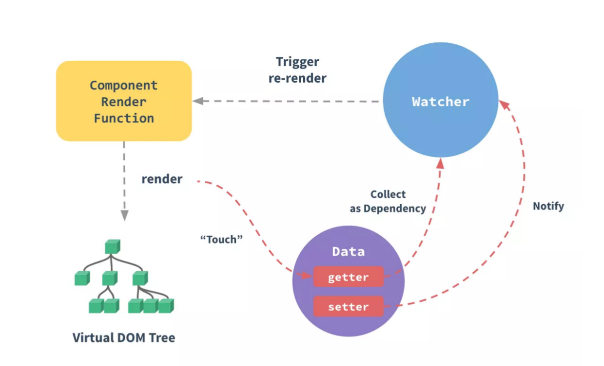
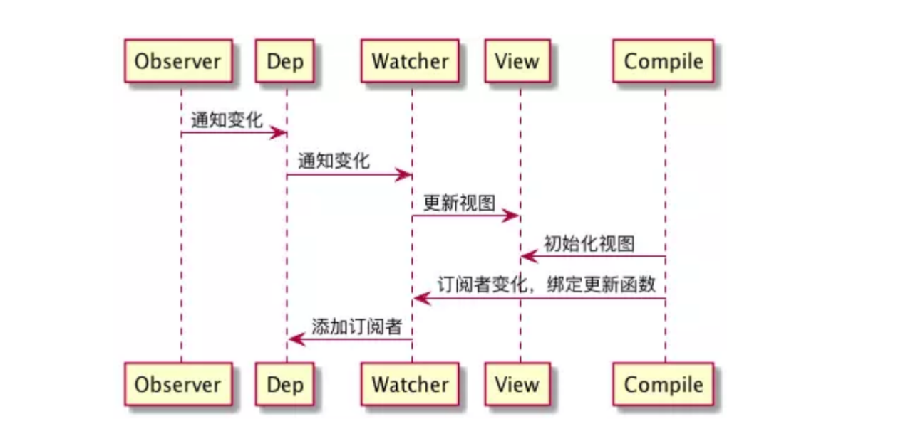
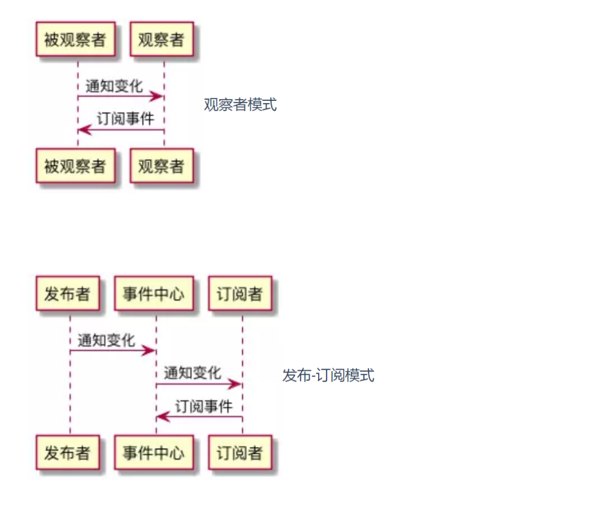

# Vue 框架是热门的渐进式 JavaScript 框架

在 Vue 中，当我们修改状态时，视图会随之更新，这就是 Vue
的数据双向绑定（又称响应式原理）。数据双向绑定是 Vue 最独特的特性之一。如果读者没有接触过
Vue，强烈建议阅读 Vue 官方对响应式原理的介绍。此处我们用官方的一张流程图来简要地说明一下 Vue
响应式系统的整个流程

在 Vue 中，每个组件实例都有相应的 watcher 实例对象，它会在组件渲染的过程中把属性记录为依赖，
之后当依赖项的 setter 被调用时，会通知 watcher 重新计算，从而致使它关联的组件得以更新——这是
一个典型的观察者模式。这道面试题考察了受试者对 Vue 底层原理的理解、对观察者模式的实现能力以
及一系列重要的 JS 知识点，具有较强的综合性和代表性。

# 在 Vue 数据双向绑定的实现逻辑里，有这样三个关键角色：

- observer（监听器）：注意，此 observer 非彼 observer。在我们上节的解析中，observer 作为设计
  模式中的一个角色，代表“订阅者”。但在 Vue 数据双向绑定的角色结构里，所谓的 observer 不仅是
  一个数据监听器，它还需要对监听到的数据进行转发——也就是说它同时还是一个发布者。
- watcher（订阅者）：observer 把数据转发给了真正的订阅者——watcher 对象。watcher 接收到新的
  数据后，会去更新视图。
- compile（编译器）：MVVM 框架特有的角色，负责对每个节点元素指令进行扫描和解析，指令的
  数据初始化、订阅者的创建这些“杂活”也归它管~ 这三者的配合过程如图所示：

OK，实现方案搞清楚了，下面我们给整个流程中涉及到发布-订阅这一模式的代码来个特写：

# 核心代码 见核心代码.js

# 观察者模式与发布-订阅模式的区别是什么？

在面试过程中，一些对细节比较在意的面试官可能会追问观察者模式与发布-订阅模式的区别。这个问
题可能会引发一些同学的不适，因为在大量参考资料以及已出版的纸质书籍中，都会告诉大家“发布-订
阅模式和观察者模式是同一个东西的两个名字”。本书在前文的叙述中，也没有突出强调两者的区别。
其实这两个模式，要较起真来，确实不能给它们划严格的等号。
为什么大家都喜欢给它们强行划等号呢？这是因为就算划了等号，也不影响我们正常使用，毕竟两者在
核心思想、运作机制上没有本质的差别。但考虑到这个问题确实可以成为面试题的一个方向，此处我们
还是单独拿出来讲一下。
回到我们上文的例子里。韩梅梅把所有的开发者拉了一个群，直接把需求文档丢给每一位群成员，这种
发布者直接触及到订阅者的操作，叫观察者模式。但如果韩梅梅没有拉群，而是把需求文档上传到了公
司统一的需求平台上，需求平台感知到文件的变化、自动通知了每一位订阅了该文件的开发者，这种发
布者不直接触及到订阅者、而是由统一的第三方来完成实际的通信的操作，叫做发布-订阅模式。
相信大家也已经看出来了，观察者模式和发布-订阅模式之间的区别，在于是否存在第三方、发布者能
否直接感知订阅者（如图所示）

在我们见过的这些例子里，韩梅梅拉钉钉群的操作，就是典型的观察者模式；而通过 EventBus 去实现事
件监听/发布，则属于发布-订阅模式。
既生瑜，何生亮？既然有了观察者模式，为什么还需要发布-订阅模式呢？
大家思考一下：为什么要有观察者模式？观察者模式，解决的其实是模块间的耦合问题，有它在，即便
是两个分离的、毫不相关的模块，也可以实现数据通信。但观察者模式仅仅是减少了耦合，并没有完全
地解决耦合问题——被观察者必须去维护一套观察者的集合，这些观察者必须实现统一的方法供被观察
者调用，两者之间还是有着说不清、道不明的关系。
而发布-订阅模式，则是快刀斩乱麻了——发布者完全不用感知订阅者，不用关心它怎么实现回调方法，
事件的注册和触发都发生在独立于双方的第三方平台（事件总线）上。发布-订阅模式下，实现了完全
地解耦。
但这并不意味着，发布-订阅模式就比观察者模式“高级”。在实际开发中，我们的模块解耦诉求并非总是
需要它们完全解耦。如果两个模块之间本身存在关联，且这种关联是稳定的、必要的，那么我们使用观
察者模式就足够了。而在模块与模块之间独立性较强、且没有必要单纯为了数据通信而强行为两者制造
依赖的情况下，我们往往会倾向于使用发布-订阅模式。
